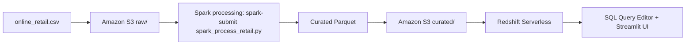

# Distributed Data Processing Pipeline for Online Retail Analytics

**Course:** DSC3219 Cloud and Distributed Computing  
**Program:** BSc Data Science  
**Semester:** Easter 2026  
**Student:** ____________________  
**Registration Number:** ____________________  
**Date:** April 2026

---

## Executive Summary

This report documents the implementation of a three-stage cloud/distributed data pipeline on the UCI Online Retail dataset:

1. **Input stage:** ingest to Amazon S3  
2. **Processing stage:** true Spark executor-based processing using `spark-submit`  
3. **Result store stage:** Amazon Redshift Serverless load and SQL querying

The report now includes milestone tracking, a Software Requirements Specification (SRS), and system design content in one document, with supporting standalone files.

---

## 1. Milestone Coverage

| Milestone | Target Deliverable | Execution Status | Evidence |
|---|---|---|---|
| M1: Problem and dataset definition | Real web dataset chosen and acquired | Completed | `pipeline/scripts/download_retail_dataset.py`, `pipeline/data/raw/online_retail.csv` |
| M2: Input stage implementation | Raw data stored in distributed cloud storage | Completed | `s3://nambooze-bucket/raw/online_retail.csv`, `pipeline/scripts/aws_upload.py` |
| M3: Processing stage implementation | Transformation and aggregation pipeline | Completed | `pipeline/scripts/spark_process_retail.py`, `pipeline/run_spark.ps1` |
| M4: Result store setup | Cloud warehouse table and load process | Completed | `pipeline/sql/redshift_copy_retail.sql`, `analytics.agg_retail_daily_country` |
| M5: Validation and analytics | SQL checks and preview queries | Completed | `SELECT count(*)`, sample query output |
| M6: UI and presentation | Working dashboard connected to outputs | Completed | `pipeline/demo/app.py`, `run_ui.ps1` |
| M7: Documentation finalization | Report + SRS + system design aligned to executed path | Completed | This report + `DSC3219_SRS.md` + `DSC3219_System_Design_Standalone.md` |

---

## 2. Implemented Scope

### 2.1 Dataset Used
- **Used:** `pipeline/data/raw/online_retail.csv`
- **Source:** UCI Online Retail dataset, downloaded by `pipeline/scripts/download_retail_dataset.py`
- **Not used:** synthetic datasets and removed legacy paths

### 2.2 In-Scope Implementation
- Upload raw CSV to S3
- Run true distributed Spark processing using `spark-submit`
- Generate curated Parquet aggregate
- Upload curated output to S3
- Load into Redshift Serverless
- Query and visualize in UI

### 2.3 Out-of-Scope
- HDFS ingestion
- Non-Spark local processing path
- PostgreSQL result store

---

## 3. System Design (Integrated)

### 3.1 Three-Stage Architecture

#### Input Stage (Amazon S3)
- Raw object path: `s3://nambooze-bucket/raw/online_retail.csv`
- Bucket prefixes used: `raw/`, `staging/`, `curated/`

#### Processing Stage (Spark execution only)
- Spark command used:
  - `.\pipeline\run_spark.ps1 -Master "local[4]" -Input "data/raw/online_retail.csv" -Output "data/curated/retail_daily_country"`
- Aggregation grain: `country`, `invoice_date`
- Output: `pipeline/data/curated/retail_daily_country/part-00000.parquet`

#### Result Store Stage (Amazon Redshift Serverless)
- Curated input path:
  - `s3://nambooze-bucket/curated/retail_daily_country/part-00000.parquet`
- Warehouse table:
  - `analytics.agg_retail_daily_country`
- Load method:
  - Redshift `COPY ... FORMAT AS PARQUET`

### 3.2 Data Flow Diagram



### 3.3 Design Qualities
- **Scalability:** S3, Spark executors, and Redshift Serverless scale independently
- **Fault isolation:** clear stage boundaries reduce blast radius
- **Interoperability:** Parquet as shared exchange format
- **Security:** IAM-role-based S3 read for Redshift load

---

## 4. Software Requirements Specification (SRS)

### 4.1 Purpose and Scope
Define functional and non-functional requirements for a retail analytics pipeline with three required stages: input, processing, and result store.

### 4.2 Stakeholders
- Student implementer
- Course examiner/lecturer
- Demo users (class audience)

### 4.3 Functional Requirements
- **FR-1:** System shall ingest `online_retail.csv` into Amazon S3 raw prefix.
- **FR-2:** System shall process raw data and output aggregated Parquet by country and invoice date using Spark executor-based processing.
- **FR-3:** System shall upload curated Parquet to S3 curated prefix.
- **FR-4:** System shall load curated data from S3 into Redshift Serverless.
- **FR-5:** System shall support SQL validation queries in Query Editor v2.
- **FR-6:** System shall provide a UI showing KPIs, trends, and preview data.
- **FR-7:** UI shall support both local Parquet mode and live Redshift query mode.

### 4.4 Non-Functional Requirements
- **NFR-1 (Reliability):** Pipeline stages must be rerunnable with idempotent table recreation when required.
- **NFR-2 (Performance):** Curated output should be stored as Parquet to optimize load/query performance.
- **NFR-3 (Security):** Access to S3 for warehouse loading shall use IAM role, not embedded credentials in SQL.
- **NFR-4 (Usability):** One-command UI launch via `run_ui.ps1`.
- **NFR-5 (Traceability):** Commands, scripts, and SQL used must be documented.

### 4.5 Constraints
- AWS account, IAM role attachment, and region setup required
- Spark mode requires Java and Spark installation with `spark-submit` in `PATH`

### 4.6 Acceptance Criteria
- Raw CSV exists in S3 `raw/`
- Curated Parquet exists locally and in S3 `curated/`
- `COPY` completes into `analytics.agg_retail_daily_country`
- Validation SQL returns non-empty results
- UI loads and displays metrics/charts

---

## 5. Commands and SQL Actually Used

### 5.1 Input Upload

```powershell
python scripts/aws_upload.py --bucket nambooze-bucket --key raw/online_retail.csv --file data/raw/online_retail.csv
```

### 5.2 Processing Command (Spark)

```powershell
.\pipeline\run_spark.ps1 -Master "local[4]" -Input "data/raw/online_retail.csv" -Output "data/curated/retail_daily_country"
```

### 5.3 Curated Upload

```powershell
python scripts/aws_upload.py --bucket nambooze-bucket --key curated/retail_daily_country/part-00000.parquet --file data/curated/retail_daily_country/part-00000.parquet
```

### 5.4 Redshift Load SQL

```sql
create schema if not exists analytics;

drop table if exists analytics.agg_retail_daily_country;

create table analytics.agg_retail_daily_country (
  country varchar(128),
  invoice_date timestamp,
  total_revenue double precision,
  order_count bigint,
  line_count bigint
);

copy analytics.agg_retail_daily_country
from 's3://nambooze-bucket/curated/retail_daily_country/'
iam_role 'arn:aws:iam::995501883037:role/RedshiftS3CuratedReadRole'
format as parquet;
```

### 5.5 Validation SQL

```sql
select count(*) from analytics.agg_retail_daily_country;
select * from analytics.agg_retail_daily_country limit 20;
```

---

## 6. Security and Access Controls Applied

- IAM role used for Redshift S3 read:
  - `arn:aws:iam::995501883037:role/RedshiftS3CuratedReadRole`
- Required permissions:
  - `s3:ListBucket` on bucket with curated-prefix scope
  - `s3:GetObject` on `curated/retail_daily_country/*`
- Role attached to Redshift Serverless namespace before running `COPY`

---

## 7. Issues Encountered and Fixes

### 7.1 Redshift S3 Access Denied
- **Issue:** `s3:ListBucket` denied during `COPY`
- **Fix:** update IAM policy and attach role to namespace

### 7.2 Parquet Schema Mismatch
- **Issue:** `invoice_date` type mismatch
- **Fix:** recreate table with compatible type (`timestamp`)

### 7.3 PowerShell Command Separator Issue
- **Issue:** `&&` not accepted in active shell context
- **Fix:** use `;` and exit-code checks

### 7.4 Spark Runtime Prerequisite
- **Issue:** Spark mode requires `spark-submit` availability and Java runtime
- **Fix:** install Spark + JDK and run processing via `pipeline/run_spark.ps1`

---

## 8. Final Outcome

- Input stage (S3 raw upload): **completed**
- Processing stage (Spark executor execution): **completed**
- Result store (Redshift Serverless load): **completed**
- UI dashboard (local + Redshift mode): **completed**
- Documentation milestones + SRS + system design alignment: **completed**

---

## 9. Document Map

- Main report (milestones + SRS + integrated design): `DSC3219_Cloud_Distributed_Project_Report.md`
- Standalone system design: `DSC3219_System_Design_Standalone.md`
- Standalone SRS: `DSC3219_SRS.md`
- Execution guide: `pipeline/README.md`

---

## References

[1] D. Chen, “Online Retail,” UCI Machine Learning Repository, 2015. https://archive.ics.uci.edu/dataset/352/online+retail  
[2] Amazon Web Services, “Amazon S3 Documentation,” 2026. https://docs.aws.amazon.com/s3/  
[3] Amazon Web Services, “Amazon Redshift Documentation,” 2026. https://docs.aws.amazon.com/redshift/  
[4] Streamlit Documentation. https://docs.streamlit.io/
