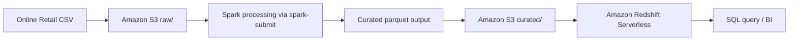

# DSC3219 Standalone System Design

## Project Title
Distributed Retail Data Pipeline (Implemented Path)

## 1. Design Goal
Document the implemented three-stage flow:
- **Input stage:** Amazon S3 raw upload
- **Processing stage:** distributed Spark executor aggregation
- **Result store:** Amazon Redshift Serverless warehouse load

## 2. Stages Used

### Input stage (Amazon S3)
- Dataset used: `online_retail.csv` only
- Uploaded path: `s3://nambooze-bucket/raw/online_retail.csv`
- Supporting prefixes in bucket: `raw/`, `curated/`, `staging/`

### Processing stage (Spark execution only)
- Spark command:
  - `run_spark.ps1 -Master "local[4]" -Input "data/raw/online_retail.csv" -Output "data/curated/retail_daily_country"`
- Output generated:
  - `pipeline/data/curated/retail_daily_country/part-00000.parquet`
- Aggregation logic:
  - group by `country` and `invoice_date`
  - compute `total_revenue`, `order_count`, `line_count`

### Result store stage (Amazon Redshift Serverless)
- Curated parquet uploaded to:
  - `s3://nambooze-bucket/curated/retail_daily_country/part-00000.parquet`
- Loaded into table:
  - `analytics.agg_retail_daily_country`
- Load method:
  - Redshift `COPY ... FORMAT AS PARQUET` from S3

## 3. Architecture Overview



## 4. Commands Used

### Input upload
```powershell
python scripts/aws_upload.py --bucket nambooze-bucket --key raw/online_retail.csv --file data/raw/online_retail.csv
```

### Processing with Spark
```powershell
.\pipeline\run_spark.ps1 -Master "local[4]" -Input "data/raw/online_retail.csv" -Output "data/curated/retail_daily_country"
```

### Curated upload
```powershell
python scripts/aws_upload.py --bucket nambooze-bucket --key curated/retail_daily_country/part-00000.parquet --file data/curated/retail_daily_country/part-00000.parquet
```

### Redshift load
```sql
copy analytics.agg_retail_daily_country
from 's3://nambooze-bucket/curated/retail_daily_country/'
iam_role 'arn:aws:iam::995501883037:role/RedshiftS3CuratedReadRole'
format as parquet;
```

## 5. Security and Access
- S3 access controlled by IAM role policies
- Redshift Serverless namespace associated with `RedshiftS3CuratedReadRole`
- Required role permissions include:
  - `s3:ListBucket` on bucket
  - `s3:GetObject` on curated prefix

## 6. Validation
- Schema/table created in Redshift under `analytics`
- COPY executed from S3 curated prefix
- Query Editor v2 used for load and validation SQL
- Validation query:
```sql
select count(*) from analytics.agg_retail_daily_country;
```
